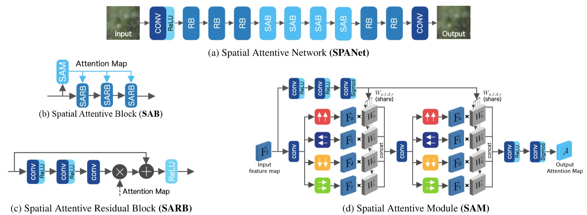
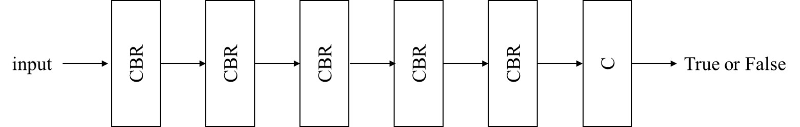
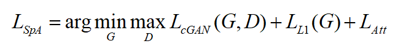
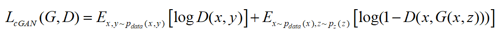
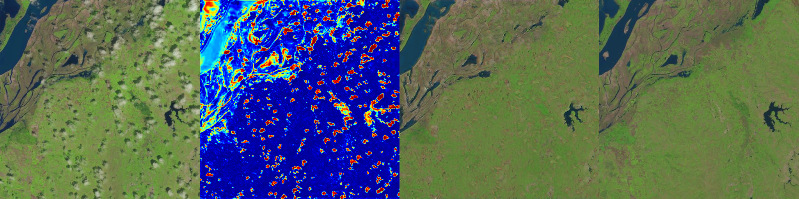
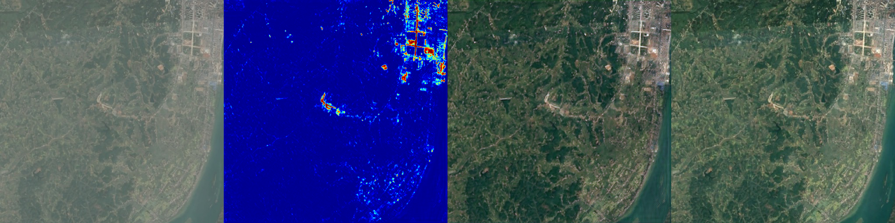

# *SpA GAN* for cloud removal

## 1. INTRODUCTION

This is the source code of my graduation thesis named ***Cloud Removal for High-resolution Remote Sensing Imagery based on Generative Adversarial Networks***. In this work, I proposed a novel model called ***spatial attention generative adversarial networks*** or ***SpA GAN***, which use [spatial attention networks (SPANet)](https://github.com/stevewongv/SPANet) as generator. The architecture of *SpA GAN* is shown as fellow:

- **Generator**

*SpA GAN* uses *spatial attention networks* an generator. See `./models/gen/SPANet.py` for more details.



- **Discriminator**

Discriminator is a fully  CNN that **C** is convolution layer, **B** is batch normalization and **R** is Leaky ReLU. See `./models/dis/dis.py` for more details.



- **Loss**

The total loss of *SpA GAN* is formulated as fellow:



and




## 2. DATASET

### 2.1. RICE_DATASET

Click [here](https://github.com/BUPTLdy/RICE_DATASET) to download the open source RICE dataset. Build the file structure as the folder `data` shown. Here `cloudy_image` is the folder where the cloudy image is stored and the folder `ground_truth` stores the corresponding cloudless images.

```
./
+-- data
    +--	RICE_DATASET
        +--	RICE1
        |   +-- cloudy_image
        |   |   +-- 0.png
        |   |   +-- ...
        |   +-- ground_truth
        |       +-- 0.png
        |       +-- ...
        +--	RICE2
            +-- cloudy_image
            |   +-- 0.png
            |   +-- ...
            +-- ground_truth
                +-- 0.png
                +-- ...
```

### 2.2. Perlin Dataset

Construct the dataset by adding Perlin noise as cloud into the image.

## 3. TRAIN

Modify the `config.yml` to set your parameters and run:

```bash
python train.py
```

## 4. TEST

```bash
python predict.py --config <path_to_config.yml_in_the_out_dir> --test_dir <path_to_a_directory_stored_test_data> --out_dir <path_to_an_output_directory> --pretrained <path_to_a_pretrained_model> --cuda
```

## 5. RESULTS

Some results are shown as bellow and the images from left to right are: cloudy image, attention map, SpA GAN's output, ground truth.





## 6. CONTACT

Contact me if you have any questions about the code and its execution.

E-mail: poonhang96@gmail.com